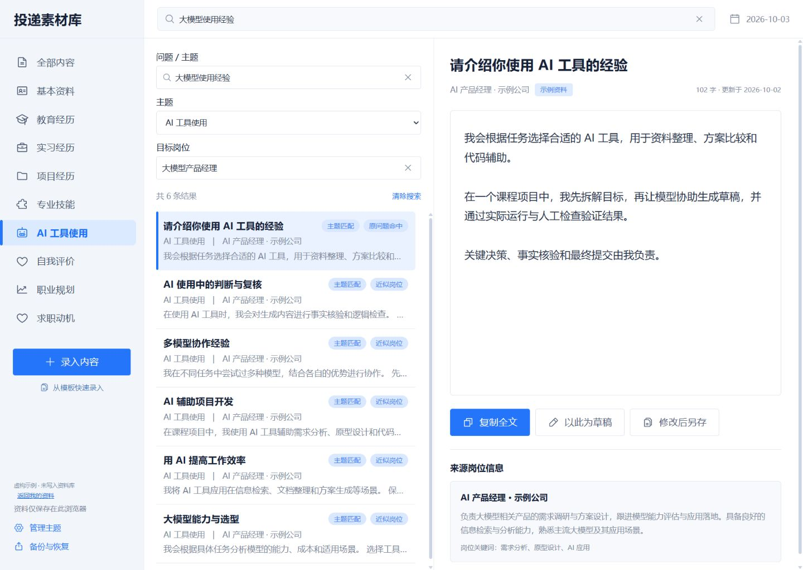
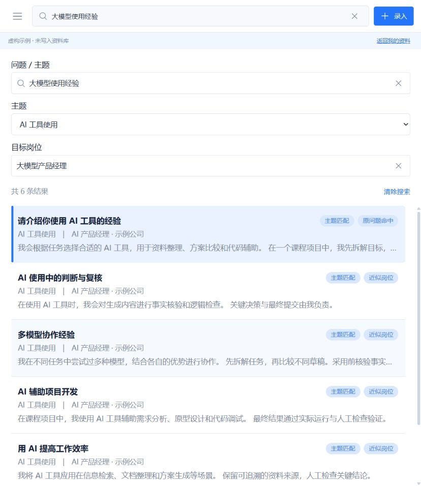
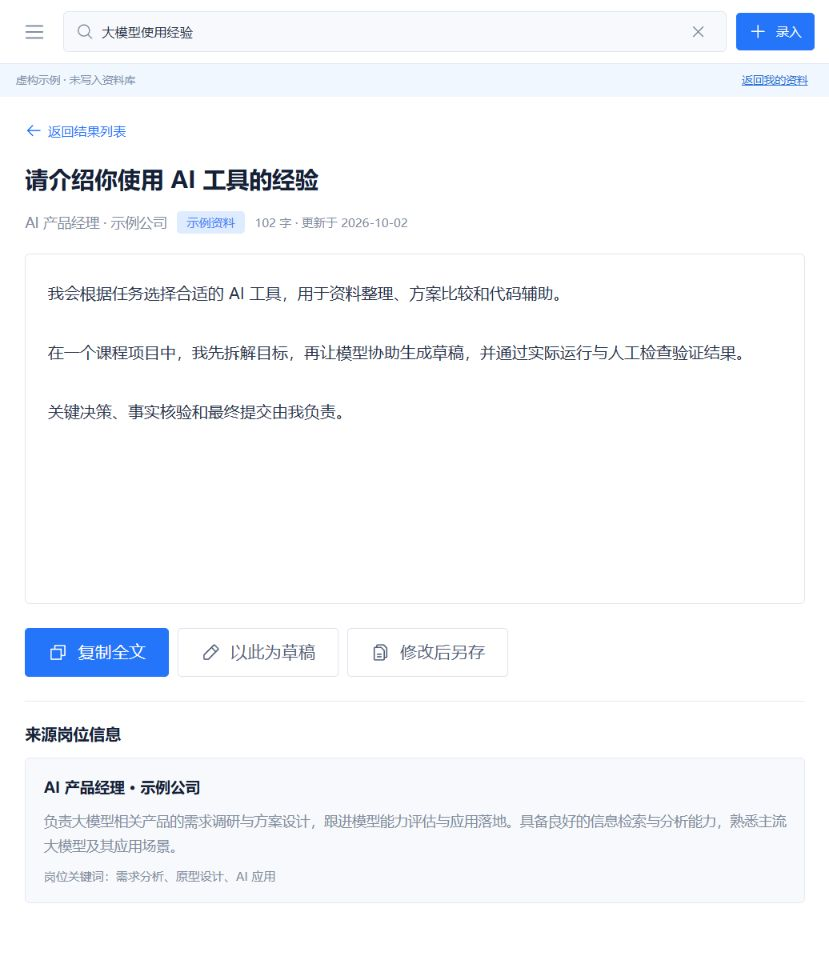
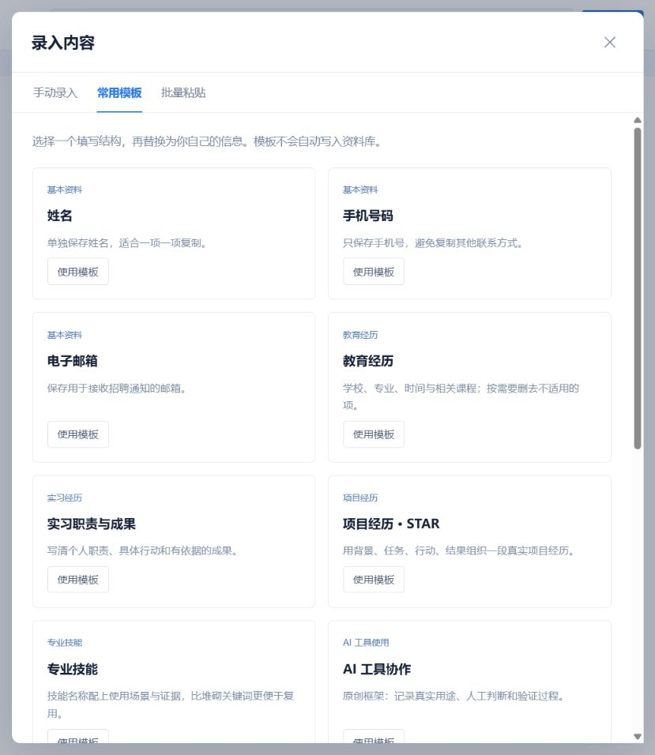
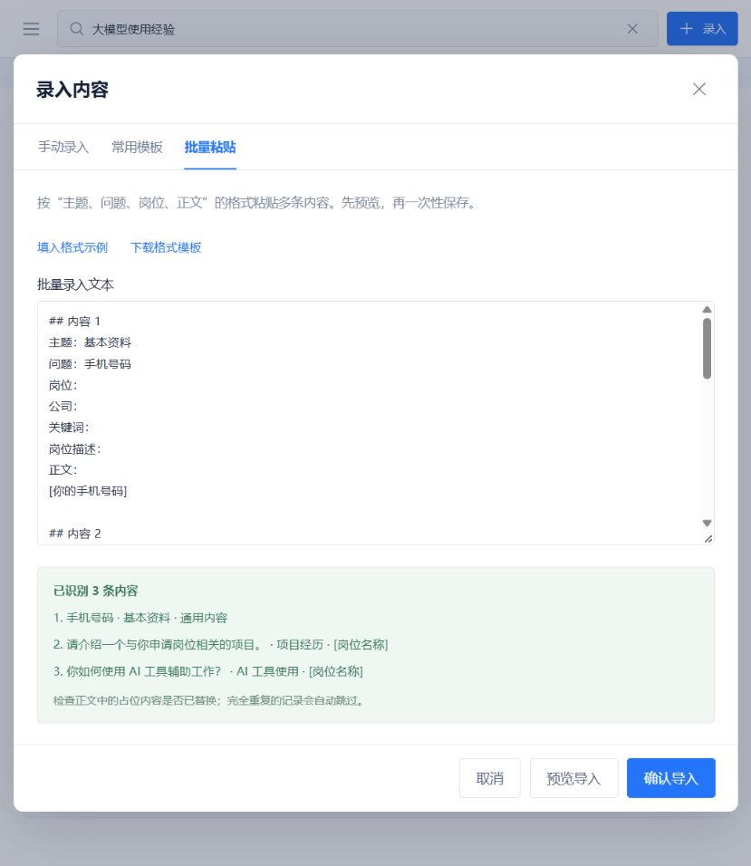

<div align="center">

# eassyjob · 投递素材库

### 把填过的回答存下来，下次投递更从容。

按主题整理，按问题与岗位找回，核对后复制到招聘表单。


<p>
  
  
  
  
</p>

[看看它怎么用](#看看它怎么用) · [快速开始](#快速开始) · [详细使用说明](使用说明.md) · [反馈与建议](https://github.com/Heleen-z/eassyjob/issues)

</div>

---

## 为经常填写网申的你准备

“项目经历又要写一遍。”“上次那段自我介绍存在哪里？”“换一个岗位，旧回答还能怎么改？”

**eassyjob 是一个在自己电脑上运行的求职填写辅助网站。** 把联系方式、经历介绍和常见问题回答保存为素材，下次投递时找回合适的版本，调整后再复制。让认真写过的内容，更容易继续用起来。

| 你遇到的情况 | 可以这样用 |
| :--- | :--- |
| 一份网申里，姓名、联系方式、教育经历反复填写 | 将通用资料拆成独立记录，按字段查找和复制 |
| “请介绍一个相关项目”，不同岗位都会问 | 同时保存回答与来源岗位，检索时有上下文可参考 |
| 为新岗位改了一版回答，还想留着旧版本 | 选择“修改后另存”，保留原回答与来源关联 |
| 回答散落在笔记里，想一次整理进来 | 按格式批量粘贴，先预览，再确认导入 |

## 看看它怎么用

**搜索与阅读分开，找到回答后再核对内容。** 桌面宽屏采用“主题 → 搜索结果 → 完整回答”三栏工作台；窄屏切换结果列表与详情，方便集中阅读。

[](docs/images/desktop.png)

<sub>桌面宽屏全景 · 下方展示窄屏检索、详情与录入流程。</sub>

<table>
  <tr>
    <td width="50%" valign="top">
      <h3>01 · 找回合适的回答</h3>
      <p>输入问题或主题，需要时补充目标岗位。匹配提示帮助你筛选旧素材。</p>
      <a href="docs/images/search.jpg"></a>
    </td>
    <td width="50%" valign="top">
      <h3>02 · 看全文，再复制</h3>
      <p>查看完整正文、字数和来源岗位；适用时复制，需调整时另存。</p>
      <a href="docs/images/answer.jpg"></a>
    </td>
  </tr>
</table>

<sub>以上为应用实际界面，使用自带的虚构示例，未包含个人求职资料。点击图片可放大查看。</sub>

## 从第一条素材，到自己的回答库

<table>
  <tr>
    <td width="50%" valign="top">
      <h3>不知道从哪开始？用模板搭个框架</h3>
      <p>12 个中文模板覆盖联系方式、经历、技能与常见网申问题。替换占位内容，再保存自己的真实经历。</p>
      <a href="docs/images/templates.jpg"></a>
    </td>
    <td width="50%" valign="top">
      <h3>已有一批笔记？先预览，再入库</h3>
      <p>按格式粘贴多条内容，检查主题、题目和岗位；确认后批量保存，完全重复项自动跳过。</p>
      <a href="docs/images/import.jpg"></a>
    </td>
  </tr>
</table>

| 能力 | 用起来是什么样 |
| :--- | :--- |
| **三种录入方式** | 手动填写、套用可编辑模板、批量粘贴预览 |
| **按问题与岗位检索** | 结合主题、关键词、文字相似度和部分岗位同义词辅助查找 |
| **完整正文复制** | 保留正文换行；自动复制不可用时，选中原文后手动复制 |
| **保留不同版本** | “编辑”更新当前记录；“修改后另存”保留原回答与来源关联 |
| **自己组织主题** | 内置 9 类主题，也能新增主题、修改名称和配置检索别名 |
| **备份与迁移** | 导出本地 JSON；恢复前检查，合并时跳过重复、冲突另存 |

### 日常使用，只需要四步

| ① 保存 | ② 找回 | ③ 核对 | ④ 复制 |
| :--- | :--- | :--- | :--- |
| 第一次填写时，保存题目、正文和相关岗位 | 下次用问题、主题或目标岗位搜索 | 检查经历事实、公司名称和表单字数限制 | 复制完整正文，粘贴到招聘表单 |

想先体验？启动后点击 **“先看看示例”**，无需录入自己的资料。示例模式不会把虚构内容写进资料库。

## 快速开始

### 第一次安装

准备 [Node.js](https://nodejs.org/) **22.12 或更高版本**（也支持 **20.x，版本不低于 20.19.0**）。使用 Git 下载，或在仓库页面选择 **Code → Download ZIP** 后解压。

```bash
git clone https://github.com/Heleen-z/eassyjob.git
cd eassyjob
npm ci
npm run build
npm start
```

在浏览器打开 [http://127.0.0.1:4173](http://127.0.0.1:4173)。如果下载的是 ZIP，在解压后的项目文件夹打开终端，执行上面最后三行即可。

> **首次需要构建。** 仓库提供源码，`npm run build` 会生成运行所需页面；安装依赖和构建时需要联网。日常启动不需要 API 密钥。

### 之后怎么打开？

| 系统 | 启动 | 停止 |
| :--- | :--- | :--- |
| **Windows** | 首次安装、构建后，双击 `启动应用.cmd`，自动打开浏览器 | 双击 `停止应用.cmd` |
| **macOS / Linux** | 在项目目录运行 `npm start`，再打开固定地址 | 在运行服务的终端按 `Ctrl+C` |

关闭网页不会停止本地服务。重新启动后，使用同一个浏览器与固定地址，可以继续访问已保存的素材。

## 资料放在哪里？

**你的填写资料保存在当前浏览器的 IndexedDB 中。** 应用没有云同步，也不调用模型。安装和构建完成后，可在本机离线启动、整理与检索资料。

- **记住一个固定入口：** `http://127.0.0.1:4173`。不同地址、端口、浏览器或浏览器配置文件会使用不同资料库。
- **定期导出备份：** 在“备份与恢复”中下载 JSON。清理浏览器数据、更换电脑或浏览器前，先保存备份。
- **备份自行保管：** JSON 包含你录入的资料，分享仓库时无需分享自己的备份。

## 使用前，知道这几件事

- 它帮助你整理和复用已写过的内容；**不会自动填表、自动投递或生成回答**。
- 近似检索是本地规则辅助查找。复用前请核对岗位适配度，模板中的占位内容也要替换为真实经历。
- “编辑”直接更新原记录，需要保留旧回答时请选择“修改后另存”。
- 当前仓库提供本地运行版本。GitHub 仓库链接用于获取源码，浏览器里的个人资料随浏览器环境保存。

<details>
<summary><strong>开发与验证</strong></summary>

使用 React、Vite 和 IndexedDB。应用界面位于 `src/`，本地静态服务位于 `scripts/local-server.mjs`。

```bash
# 开发预览（与固定使用地址的资料库独立）
npm run dev

# 构建完成后，再运行包含打包检查的测试
npm run build
npm test
```

测试覆盖检索、数据校验、重复处理、备份合并、模板解析、复制回退和本地服务等行为。

</details>

<details>
<summary><strong>截图与视觉素材</strong></summary>

封面是为项目生成的品牌插画；功能截图来自实际应用，内容为内置虚构示例及占位模板。素材与制作说明见 [图片说明](docs/images/README.md)。

</details>

## 推荐给朋友

可以直接复制这段介绍：

> 推荐一个我做的本地求职小工具 **eassyjob**：把网申里填过的项目经历、技能介绍和常见回答存成素材库，下一次按问题或岗位找回来，改好再复制。带中文模板和批量整理入口，资料保存在自己的浏览器里，也能导出 JSON 备份。项目地址：https://github.com/Heleen-z/eassyjob

如果它对你有帮助，欢迎点一个 **Star**，也欢迎通过 [Issues](https://github.com/Heleen-z/eassyjob/issues) 提出建议。反馈时，请隐去个人填写资料。

<div align="center">
<br>
<strong>让写过的好回答，成为下一次投递的起点。</strong>
<br><br>
</div>
